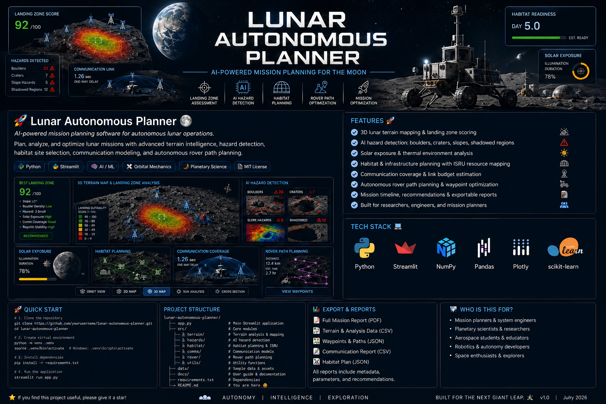

# 🚀 Lunar Autonomous Planner 🌕

<p align="center">
  
</p>

<p align="center">


</p>

<p align="center">
<b>🌕 AI-Powered Mission Planning for Autonomous Lunar Exploration</b>
</p>

---

# 🌖 Overview

**Lunar Autonomous Planner** is an interactive aerospace mission planning application that evaluates potential lunar landing sites using AI-assisted terrain analysis, hazard detection, communications modeling, habitat planning, and autonomous rover path optimization.

The application demonstrates how robotic precursor missions can safely evaluate lunar environments before crewed missions arrive, supporting future scientific exploration and sustained lunar operations.

---

# ✨ Features

## 🌍 Terrain Intelligence

- 🌕 Procedural lunar terrain generation
- 🛰️ Interactive 3D terrain visualization
- 📈 Landing suitability scoring
- ⛰️ Surface slope analysis
- 🗺️ Terrain heat maps

## 🤖 AI Hazard Detection

- 🪨 Boulder field detection
- 🌑 Crater identification
- 📉 Hazardous slope analysis
- 🌘 Shadowed region mapping
- 🚧 Landing hazard assessment

## 🏠 Habitat Planning

- Habitat placement
- Solar array positioning
- Communications infrastructure
- Power distribution planning
- ISRU resource zone assessment

## 🚜 Autonomous Rover Planning

- Rover traverse generation
- Waypoint planning
- Distance estimation
- Traverse optimization
- Hazard-aware routing

## 📡 Communications Analysis

- Earth visibility
- Relay geometry
- Coverage estimation
- One-way communication latency

## ☀️ Environmental Analysis

- Solar exposure
- Illumination duration
- Terrain suitability
- Local environmental conditions

## 📊 Mission Analytics

- Landing Zone Score
- Mission Readiness
- AI Mission Recommendations
- Engineering Reports
- JSON and CSV export

---

# 🧠 AI Decision Support

The onboard planning engine evaluates:

- Terrain slope
- Boulder density
- Crater proximity
- Solar illumination
- Communications geometry
- Surface suitability
- Overall mission risk

The system recommends the safest landing zone while balancing operational safety, communications performance, and long-term infrastructure planning.

---

# 🖥️ Technology Stack

| Technology | Purpose |
|------------|----------|
| 🐍 Python | Core application |
| 🚀 Streamlit | Interactive dashboard |
| 📈 Plotly | Scientific visualization |
| 🔢 NumPy | Numerical computation |
| 🐼 Pandas | Data processing |

---

# ⚙️ Installation

```bash
git clone https://github.com/tareqomrani/lunar-autonomous-planner.git

cd lunar-autonomous-planner

python -m venv .venv
```

Activate the virtual environment.

**Windows**

```bash
.venv\Scripts\activate
```

**macOS / Linux**

```bash
source .venv/bin/activate
```

Install dependencies.

```bash
pip install -r requirements.txt
```

Launch the application.

```bash
streamlit run app.py
```

---

# 📂 Repository Structure

```text
lunar-autonomous-planner/

├── lunar-autonomous-planner-hero.PNG
├── app.py
├── requirements.txt
├── README.md
├── docs/
└── exports/
```

---

# 🎯 Applications

- 🌕 Lunar exploration
- 🤖 Autonomous robotics
- 🛰️ Planetary mission planning
- 🏗️ Habitat site assessment
- 📡 Communications planning
- 🚜 Robotic precursor missions
- 🧠 AI-assisted decision support
- 🧭 Space systems engineering

---

# 🛣️ Roadmap

### Current

- ✅ Landing zone assessment
- ✅ Terrain analysis
- ✅ Hazard detection
- ✅ Habitat planning
- ✅ Rover path planning
- ✅ Mission reporting

### Planned

- 🌍 LRO terrain integration
- 🛰️ Digital elevation model imports
- 🤖 Multi-rover coordination
- 🧠 Machine learning landing prediction
- 🌒 Permanently shadowed region analysis
- 📡 Orbital relay simulation
- 🪨 ISRU resource assessment
- 🥽 VR mission visualization

---

# 📚 References

- NASA Artemis Program
- NASA Systems Engineering Handbook (SP-2016-6105 Rev. 2)
- NASA Lunar Reconnaissance Orbiter Mission
- ECSS Space Engineering Standards

---

# 👨‍💻 Author

**Tareq Omrani**

AI • Aerospace • Autonomous Systems • Space Mission Planning

Streamlit: share.streamlit.io/user/tareqomrani

---

# ⭐ Support

If you found this project useful:

⭐ Star the repository

🍴 Fork the repository

🚀 Share it with the aerospace community

---

> *"We choose to go to the Moon... not because it is easy, but because it is hard."*  
> **President John F. Kennedy**  
> Rice University, September 12, 1962
